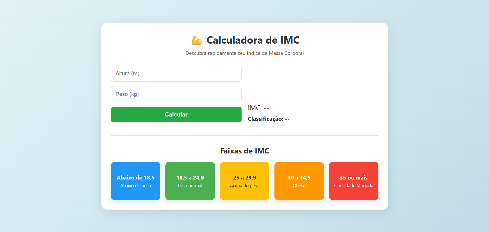

# 💪 Calculadora de IMC

Esta é uma aplicação web simples e responsiva para calcular o **Índice de Massa Corporal (IMC)**, desenvolvida com **HTML, CSS e JavaScript**. O projeto permite que os usuários insiram sua altura e peso e descubram instantaneamente seu IMC, além da classificação correspondente.

## 📸 Demonstração

 

## 🚀 Funcionalidades

- 🧮 **Cálculo automático do IMC** com base na altura e peso informados.
- 🎨 **Interface amigável**, com destaque visual para cada faixa de classificação.
- ✅ **Validação de entrada**, com mensagens de erro claras.
- 📱 **Design responsivo**, adaptado para celular e desktop.
- 🌈 **Cores e emojis** que tornam a experiência mais visual e intuitiva.

## 🛠️ Como Usar a Calculadora

1. Digite sua **altura** em metros (exemplo: `1.75`).
2. Digite seu **peso** em quilogramas (exemplo: `70.5`).
3. Clique no botão **"Calcular"**.
4. Veja seu **IMC** e a **classificação** (como "Peso normal", "Obeso", etc.).
5. Consulte as **faixas de referência** exibidas abaixo para entender sua posição.

## 💻 Como Executar Localmente

1. Clone este repositório:
   ```bash
   git clone https://github.com/seu-usuario/calculadora-imc.git
